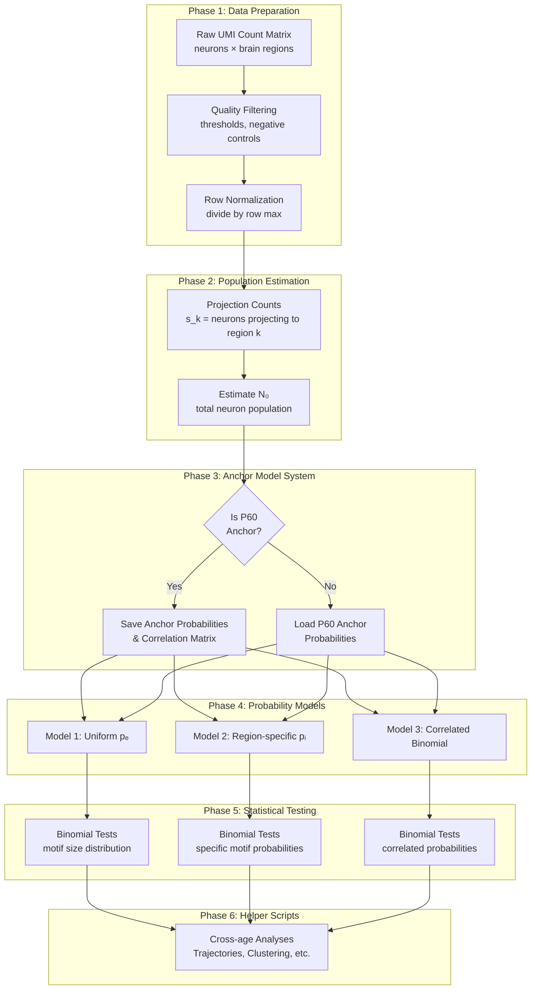

# Chapter 1: Introduction

## Overview

The MAPseq (Multiplexed Analysis of Projections by Sequencing) processing pipeline is a comprehensive computational framework for analyzing neural projection data across developmental timepoints. This pipeline processes MAPseq-labeled projection data to identify projection motifs, quantify their frequencies, and analyze temporal changes in projection patterns.

### What is MAPseq Processing?

MAPseq is a high-throughput method for tracing neural projections using molecular barcoding. The processing pipeline takes raw UMI (Unique Molecular Identifier) count matrices from the [CSHL mapseq-processing Python Pipeline](https://github.com/ZadorLaboratory/mapseq-processing) and performs:

- **Quality filtering** of barcoded neurons based on injection site and target region UMI counts
- **Population estimation** (N₀) to account for neurons projecting to unsampled regions
- **Statistical modeling** using multiple probability models to identify non-random projection patterns
- **Motif analysis** to quantify projection patterns and their developmental changes
- **Cross-cohort comparison** using an anchor model system for temporal analysis

### Central Research Questions

The pipeline addresses several key questions:

1. **Do projection motifs change significantly over developmental time?**
   - Analyzes motif frequencies across timepoints (P3, P12, P20, P60)
   - Tests stability using model-independent (Kruskal-Wallis) and model-dependent (effect size trajectories) metrics

2. **Which projection patterns are non-randomly organized?**
   - Compares observed motif frequencies to null models
   - Identifies significantly over- or under-represented motifs

3. **How do different probability models compare?**
   - Uniform edge probability model
   - Region-specific probability model
   - Correlated binomial model
   - Additional models (empirical, smoothed empirical, maximum entropy, etc.)

4. **What are the developmental trajectories of specific motifs?**
   - Tracks effect sizes across developmental stages
   - Identifies significant transitions between consecutive stages

## Pipeline Workflow

The **primary way to run** the pipeline is:

1. **Preprocessing and aggregation**: Use `preprocess_and_aggregate.py` to prepare NBCM files and produce an aggregated matrix.
2. **Run the pipeline**: Edit `all_commands.txt` (or use `all_commands_all-parameters.txt`) to match your paths and samples, then from the repository root make the script executable if needed (`chmod +x run_commands.sh`) and run **`./run_commands.sh`**. The script executes each line of the command file in order (main processing and helper scripts) and logs output.
3. **Inspect outputs**: Use the output structure and helper script results as described in the documentation (starting with [Chapter 8](08_Output_Files_Interpretation.md)).

**Execution methods**: (1) **Batch (recommended)**: Edit `all_commands.txt` (or `all_commands_all-parameters.txt`), make the script executable if needed (`chmod +x run_commands.sh`), and run `./run_commands.sh` from the repository root. (2) **Manual**: Run preprocessing, then `process-nbcm-tsv.py`, then helper scripts individually in order. (3) **GUI**: Experimental GUI options (untested) are documented in [Chapter 14: Experimental Features](14_Experimental_Features.md). Optional QC: `postprocessing_checks.py` (see [Chapter 8: Output Files and Structure](08_Output_Files_Interpretation.md)). Optional lab batch scripts (figure aggregation, conclusions generation) are **not** part of the standard end-user path; see [Chapter 14: Experimental Features](14_Experimental_Features.md).

## Before you run

1. **Process fastq with the CSHL mapseq-processing pipeline**: The pipeline expects NBCM (neural barcode count matrix) files produced by the [CSHL mapseq-processing Python Pipeline](https://github.com/ZadorLaboratory/mapseq-processing). Run that pipeline first to obtain `.nbcm.tsv` files.
2. **Use preprocessing and aggregation for cohort analysis**: Use `preprocess_and_aggregate.py` to standardize column names, apply noise filtering, and produce an aggregated matrix for multi-sample analysis. See [Chapter 3: Data Preparation](03_Data_Preparation.md).
3. **Ensure CSHL output includes your samples, negative control, and injection columns**: When configuring the upstream CSHL pipeline, include your target regions, a negative control column, and an injection site column in the output.
4. **Sample data and labels**: The repository includes example data and label files in `sample_data/` (e.g. `JR0375.nbcm.tsv`, `labels_for_jr0375`) for format guidance. See those files when in doubt about column order and the `-l` labels argument. See [Chapter 3: Data Preparation](03_Data_Preparation.md) and [Chapter 4: Main Processing Pipeline](04_Main_Processing_Pipeline.md) for details.

## Pipeline Architecture

The MAPseq processing pipeline consists of three main components:

### 1. Main Processing Script

**`process-nbcm-tsv.py`** - Per-sample processing and statistical testing

- Processes individual or aggregated NBCM (neural barcode count matrix) files
- Performs quality filtering and normalization
- Estimates population size (N₀)
- Calculates motif probabilities using multiple models
- Performs statistical testing (binomial tests)
- Generates visualizations and output files

### 2. Helper Scripts

A series of 14 helper scripts (numbered 01-14) that perform cross-age analyses:

- **Scripts 01-04**: Per-animal statistics, projection analysis, composition, and proportions
- **Scripts 05-08**: Motif frequency analysis, divergence, trajectories, and clustering
- **Scripts 09-14**: Visualization, dataset comparison, and aggregation

### 3. Supporting Tools

- **Preprocessing**: `preprocess_and_aggregate.py` for data preparation
- **Quality Control**: `postprocessing_checks.py` for output verification
- **Figure Generation**: Scripts for publication-ready figures
- **Experimental GUI tools**: Documented in [Chapter 14: Experimental Features](14_Experimental_Features.md)

## Key Concepts

### Projection Motifs

A **projection motif** is a specific combination of target brain regions to which a neuron projects. For example, a neuron projecting to both AL (Anterolateral) and PM (Posteromedial) regions represents the motif "AL+PM".

With n target regions, there are 2ⁿ - 1 possible motifs (excluding the null case of no projections). The pipeline analyzes all observed motifs and compares their frequencies to expected values from statistical models.

### Population Estimation (N₀)

**N₀** represents the true (latent) neuron population size, accounting for neurons that may project only to unsampled regions. The pipeline estimates N₀ using the inclusion-exclusion principle:

$$\pi = 1 - \prod_{k=0}^{m}\left(1 - \frac{s_k}{N_0}\right)$$

where π is the detection probability and sₖ is the number of neurons projecting to region k.

### Anchor Model System

For cross-cohort comparative analysis, the pipeline uses an **anchor model system** where P60 (adult) serves as the baseline. Developmental cohorts (P3, P12, P20) are compared against P60-anchored probabilities:

$$Expected_{motif} = P_{P60}(motif) \times N_0^{local}$$

This separates biological projection patterns (from P60) from population size differences (local N₀).

### Effect Size

**Effect size** quantifies the magnitude of deviation from model expectations:

$$Effect\ Size = \log_2\left(\frac{Observed + 1}{Expected + 1}\right)$$

- Effect Size > 0: Motif is over-represented
- Effect Size < 0: Motif is under-represented
- Effect Size ≈ 0: Motif frequency matches expectation

## Pipeline Workflow



## Output Structure

Results are organized in a hierarchical directory structure:

```
02_output/
├── {age}/                          # P3, P12, P20, P60
│   └── {parameterization}/         # Filter parameter set
│       ├── analysis/
│       │   ├── uniform/           # Uniform model results
│       │   ├── region_specific/   # Region-specific model results
│       │   └── correlated/       # Correlated model results
│       └── {sample}_*.csv         # Per-sample outputs
└── {parameterization}_helpers/    # Helper script outputs
    ├── 01_motif_analysis_per_animal/
    ├── 05_motif_analysis/
    └── ...
```

## Documentation Organization

This documentation is organized into 16 chapters:

1. **Introduction** (this chapter) - Overview and key concepts
2. **Installation and Setup** - System requirements and installation
3. **Data Preparation** - Preprocessing and data format
4. **Main Processing Pipeline** - Core analysis script
5. **Statistical Methods** - N₀ estimation, binomial testing
6. **Probability Models** - All probability models explained
7. **Helper Scripts** - Cross-age analysis scripts
8. **Output Files and Structure** - Paths, filenames, and column reference
9. **Code Review** - Architecture and implementation details
10. **Mathematical Functions Reference** - All formulas with code references
11. **Stability Analysis** - Generic stability metrics framework
12. **Troubleshooting and Best Practices** - Common issues and solutions
13. **References and Appendices** - Code references, notation glossary
14. **Experimental Features** - GUI wizards and maintainer batch tools
15. **Trajectory Results** - Helper 15 file/method reference (no bundled results)
16. **Cross-Anchor Analysis** - Conceptual checklist for anchor comparisons

## Next Steps

- **New users**: Proceed to [Chapter 2: Installation and Setup](02_Installation_Setup.md)
- **Data preparation**: See [Chapter 3: Data Preparation](03_Data_Preparation.md)
- **Understanding methods**: See [Chapter 5: Statistical Methods](05_Statistical_Methods.md) and [Chapter 6: Probability Models](06_Probability_Models.md)
- **Output layout**: See [Chapter 8: Output Files and Structure](08_Output_Files_Interpretation.md)

---

*For detailed code implementation, see [Chapter 9: Code Review](09_Code_Review.md). For all mathematical formulas, see [Chapter 10: Mathematical Functions Reference](10_Mathematical_Functions.md).*
