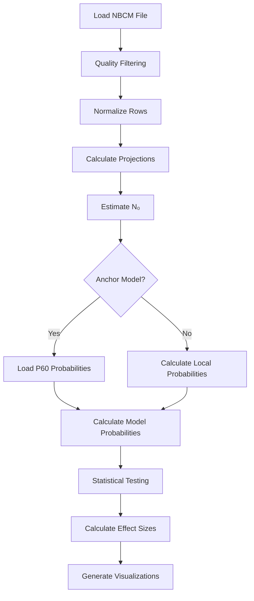

# Chapter 4: Main Processing Pipeline

## Overview

The main processing script `process-nbcm-tsv.py` is the core of the MAPseq analysis pipeline. It performs per-sample processing of NBCM (neural barcode count matrix) data, including quality filtering, normalization, population estimation, probability model calculations, and statistical testing.

## Recommended: Batch Run via Command File

The standard workflow is to include `process-nbcm-tsv.py` (and later helper script) commands in `all_commands.txt` (or `all_commands_all-parameters.txt`), make the script executable if needed (`chmod +x run_commands.sh`), and run **`./run_commands.sh`** from the repository root. The script executes each line of the command file in order and logs output. Edit the command file so paths and sample names match your project. See [Chapter 1: Introduction](01_Introduction.md) and [Chapter 2: Installation and Setup](02_Installation_Setup.md) for the full workflow.

The sections below describe the main script in detail for understanding and for manual execution of individual runs.

## Command-Line Interface

### Basic Usage

```bash
python process-nbcm-tsv.py \
    -o /path/to/output \
    -s sample_name \
    -d /path/to/data.tsv \
    -l "RSP,PM,AM,AL,LM,neg,inj"
```

### Required Arguments

| Argument | Description |
|----------|-------------|
| `-o, --out_dir` | Output directory for saving results |
| `-s, --sample_name` | Sample name (prefix for output files) |
| `-d, --data_file` | Path to input NBCM file (`.tsv` or aggregated matrix) |
| `-l, --labels` | Comma-separated column labels (must include `neg` and `inj`) |

**Label Format:**
- Use `neg` for negative control columns and `inj` for injection site column (required).
- Use any names for target regions (e.g., `RSP`, `PM`, `AM`, `AL`, `LM`); avoid spaces and special characters in the list.
- No spaces between labels: `"RSP,PM,AM,AL,LM,neg,inj"`.
- The code may sort target areas if you use repeat-value names (e.g. `visp1,visp2,visp3`). Multiple `neg` or `inj` columns in a matrix are untested.

### Optional Arguments

| Argument | Default | Description |
|----------|---------|-------------|
| `-i, --injection_umi_min` | 1 | Minimum injection UMI threshold (Han et al. 2018: 300; Klingler et al. 2018: 100) |
| `-t, --min_target_count` | 10 | Minimum UMI in at least one target (Han et al. 2018: 10) |
| `-r, --min_body_to_target_ratio` | 10 | Minimum injection/target ratio (Han et al. 2018: 10) |
| `-u, --target_umi_min` | 2 | Threshold for target UMI noise filtering: values in a row below this are set to zero (e.g. row `[0,1,0,35,12,1,0,120,1,0]` with default 2 becomes `[0,0,0,35,12,0,0,120,0,0]`) |
| `-a, --alpha` | 0.05 | Significance threshold for Bonferroni correction |
| `-f, --apply_outlier_filtering` | False | Enable outlier filtering (mean + 2×std) |
| `--force_user_threshold` | False | If set, use your `-u` value; otherwise the script may use the larger of: your value, UMI KDE elbow, max value in negative control column, or default 2 |
| `--is-anchor-model` | False | Mark as anchor/baseline model (P60) |
| `--anchor-model-file` | None | Path to anchor probabilities CSV |
| `--anchor-correlation-file` | None | Path to anchor correlation matrix CSV |
| `--model-type` | `all` | One of: `uniform`, `region_specific`, `correlated`, `empirical`, `smoothed_empirical`, `max_entropy`, `hierarchical_correlations`, `negative_binomial`, `zero_inflated`, `bayesian_hierarchical`, `ml_nonparametric`, `all` |
| `--smoothing-alpha` | 1.0 | Smoothing parameter α for `smoothed_empirical` |
| `--skip-sections` | None | Comma-separated sections to skip: `visualizations`, `clustering`, `heatmaps` |
| `--illustrator-volcano-dir` | None | If set, write illustrator-ready uniform volcano SVG to this directory |
| `--illustrator-report-ranges-only` | False | With `--illustrator-volcano-dir`: append ranges CSV only, skip SVG |
| `--illustrator-xlim` | None | Two floats: x-axis limits for illustrator volcano |
| `--illustrator-ylim` | None | Two floats: y-axis limits for illustrator volcano |
| `-A, --special_area_1`, `-B, --special_area_2` | — | Legacy optional region tags; most workflows use `-l` only |

## Processing Steps

### Step 1: Data Loading

**Function**: `load_df()` in `process-nbcm-tsv.py`

Loads NBCM file and extracts:
- Barcode column (required)
- Injection column (`inj`)
- Negative control column (`neg`)
- Target region columns

**Code Reference**: `process-nbcm-tsv.py::load_df()`

### Step 2: Quality Filtering

**Function**: `clean_and_filter()` in `process-nbcm-tsv.py`

**Filtering Steps:**

1. **Remove zero-projection rows**: Cells with no target projections
2. **Negative control filtering**: Remove rows where `neg > 0`
3. **Injection threshold**: Remove rows where `inj < injection_umi_min`
4. **Target threshold**: Remove rows where no target has UMI ≥ `min_target_count`
5. **Injection-to-target ratio**: Remove rows where `inj / max(target) < min_body_to_target_ratio`
6. **Target UMI thresholding**: Set target values < `target_umi_min` to zero
7. **Optional outlier filtering**: Remove rows with values > mean + 2×std

**Code Reference**: `process-nbcm-tsv.py::clean_and_filter()`

### Step 3: Normalization

**Function**: `normalize_rows()` in `process-nbcm-tsv.py`

Each row (cell) is normalized by its maximum value:

$$normalized_{ij} = \frac{value_{ij}}{\max_k(value_{ik})}$$

This converts UMI counts to relative projection strengths per cell.

**Code Reference**: `process-nbcm-tsv.py::normalize_rows()`

### Step 4: Projection Counts

**Function**: `calculate_projections_from_matrix()` in `process-nbcm-tsv.py`

Calculates:
- **Column counts**: Number of cells projecting to each region (binary presence)
- **Total projections**: Sum of column counts

**Code Reference**: `process-nbcm-tsv.py::calculate_projections_from_matrix()`

### Step 5: Population Estimation (N₀)

**Function**: `solve_for_roots()` in `process-nbcm-tsv.py`

Estimates true population size using inclusion-exclusion principle:

$$\pi = 1 - \prod_{k=0}^{m}\left(1 - \frac{s_k}{N_0}\right)$$

$$\pi \cdot N_0 = N_{obs}$$

Solves symbolically using SymPy and selects largest real root > N_obs.

**Code Reference**: `process-nbcm-tsv.py::solve_for_roots()`

**Root Selection** (in main script after `solve_for_roots()`):
```python
valid_N0 = [root for root in roots if root.is_real and root > observed_cells]
N0_value = max(valid_N0)  # Largest valid root
```

### Step 6: Anchor Model System

**Function**: `load_anchor_model()` in `process-nbcm-tsv.py`

If `--anchor-model-file` is provided:
- Loads P60 anchor probabilities
- Uses anchor probabilities with local N₀ for expected counts
- Enables cross-cohort comparison

**Expected Count Calculation** (in main script):
```python
psdict_for_expected = anchor_probs_loaded if anchor_probs_loaded else psdict_region_specific
```

**Code Reference**: `process-nbcm-tsv.py::load_anchor_model()`

### Step 7: Probability Model Calculations

Multiple probability models are calculated (see [Chapter 6: Probability Models](06_Probability_Models.md) for details):

1. **Uniform Model** (pₑ): Lines 649-671
2. **Region-Specific Model** (pᵢ): Lines 680-690, 728-763
3. **Correlated Model**: Lines 765-816
4. **Additional models**: Empirical, smoothed empirical, max entropy, etc.

**Code References**:
- Uniform: `process-nbcm-tsv.py::compute_motif_probabilities()`
- Region-specific: `process-nbcm-tsv.py::compute_motif_probabilities_region_specific()`
- Correlated: `process-nbcm-tsv.py::compute_motif_probabilities_correlated()`

### Step 8: Statistical Testing

**Function**: `binomtest()` from scipy.stats

For each motif:
- **Observed count**: Number of cells with this motif
- **Expected count**: `N₀ × P(motif)` from model
- **Binomial test**: Two-tailed test with n = N₀, p = P(motif)

**Code Reference**: `process-nbcm-tsv.py` (binomial testing section)

### Step 9: Effect Size Calculation

**Formula**:
$$Effect\ Size = \log_2\left(\frac{Observed + 1}{Expected + 1}\right)$$

**Significance Grouping**:
- Group 1: Over-represented + significant (p < α_corrected)
- Group 2: Under-represented + significant (p < α_corrected)
- Group 3: Over-represented + non-significant
- Group 4: Under-represented + non-significant

### Step 10: Visualization

Generates multiple plots:
- Effect significance plots (volcano plots)
- Upsetplots
- Per-cell projection strength plots
- 2-region motif graphs

**Code Reference**: `process-nbcm-tsv.py::plot_effect_significance()`

## Output Files

### Per-Sample Outputs

**Location**: `{out_dir}/`

| File | Description |
|------|-------------|
| `{sample}_Filtered_Matrix.csv` | Filtered UMI count matrix |
| `{sample}_Normalized_Matrix.csv` | Row-normalized matrix |
| `{sample}_UMI_Total_Counts.csv` | Summed UMI counts per region |
| `{sample}_Region-specific_Probabilities_N0based.csv` | Region probabilities (if anchor) |
| `{sample}_Conditional_Probability_Matrix.csv` | P(B\|A) matrix (if anchor) |

### Analysis Outputs

**Location**: `{out_dir}/analysis/{model}/`

| File | Description |
|------|-------------|
| `{sample}_upsetplot_{model}.csv` | Motif results with statistics |
| `{sample}_effect_significance_{model}.png` | Volcano plot |
| `{sample}_per_cell_proj_strength_{model}.png` | Per-cell projection patterns |
| `{sample}_panel_g_broadcasting_from_canonical_{model}.svg` | 2-region motif graph |
| `projection_summary.csv` | Summary metrics |

### Upsetplot CSV Columns

| Column | Description |
|--------|-------------|
| `Motifs` | List of regions in motif (e.g., "['al', 'lm']") |
| `Observed` | Count of neurons with this motif |
| `Expected` | Model-predicted count |
| `Expected SD` | Standard deviation of expected count |
| `Effect Size` | log₂(Observed/Expected) |
| `P-value` | Two-tailed binomial test p-value |
| `Degree` | Number of regions in motif |
| `Group` | Significance group (1-4) |

## Anchor Model Workflow

### Creating Anchor Model (P60)

```bash
python process-nbcm-tsv.py \
    -o 02_output/p60/05.HAN_filter_parameters_i300_r10_t10_u5 \
    -s P60_ALL \
    -d aggregated_cleaned_matrix.tsv \
    -l "RSP,PM,AM,AL,LM,neg,inj" \
    --is-anchor-model
```

**Outputs**:
- `P60_ALL_Region-specific_Probabilities_N0based.csv`
- `P60_ALL_Conditional_Probability_Matrix.csv`

### Using Anchor Model (P3, P12, P20)

```bash
python process-nbcm-tsv.py \
    -o 02_output/p12/05.HAN_filter_parameters_i300_r10_t10_u5 \
    -s P12_ALL \
    -d aggregated_cleaned_matrix.tsv \
    -l "RSP,PM,AM,AL,LM,neg,inj" \
    --anchor-model-file 02_output/p60/05.HAN_filter_parameters_i300_r10_t10_u5/P60_ALL_Region-specific_Probabilities_N0based.csv \
    --anchor-correlation-file 02_output/p60/05.HAN_filter_parameters_i300_r10_t10_u5/P60_ALL_Conditional_Probability_Matrix.csv
```

**Expected counts** use P60 probabilities with local N₀.

## Code Architecture

### Main Data Flow



### Key Functions

| Function | Lines | Purpose |
|----------|-------|---------|
| `load_df()` | 1384+ | Load and parse NBCM file |
| `clean_and_filter()` | 288-443 | Quality filtering |
| `normalize_rows()` | 271-287 | Row normalization |
| `calculate_projections_from_matrix()` | 186-212 | Calculate projection counts |
| `solve_for_roots()` | 217-224 | N₀ estimation |
| `load_anchor_model()` | 245-266 | Load anchor probabilities |
| `compute_motif_probabilities_*()` | 444+, 728+, 765+ | Model probability calculations |
| `plot_effect_significance()` | 1986+ | Visualization |

## Error Handling

### Common Errors

**Error**: "No valid positive real root found for N0"
- **Cause**: N₀ estimation failed (may indicate data quality issues)
- **Solution**: Check projection counts, verify data quality

**Error**: "Mismatch: Normalized matrix columns"
- **Cause**: Column count mismatch after filtering
- **Solution**: Verify label argument matches data columns

**Error**: "You must map a column to 'barcodes'"
- **Cause**: Missing barcode column in preprocessing
- **Solution**: Ensure preprocessing mapped a column to `barcodes`

## Performance Considerations

- **Large datasets**: Processing time scales with number of cells and regions
- **N₀ estimation**: Symbolic solving can be slow for many regions
- **Visualization**: Plot generation may take time for large motif sets
- **Memory**: Keep sufficient RAM for matrix operations

## Next Steps

After main processing:

1. **Review outputs**: Check effect significance plots and upsetplot CSVs
2. **Run helper scripts**: See [Chapter 7: Helper Scripts](07_Helper_Scripts.md)
3. **Inspect outputs**: See [Chapter 8: Output Files and Structure](08_Output_Files_Interpretation.md)

---

*For detailed statistical methods, see [Chapter 5: Statistical Methods](05_Statistical_Methods.md). For probability models, see [Chapter 6: Probability Models](06_Probability_Models.md).*
