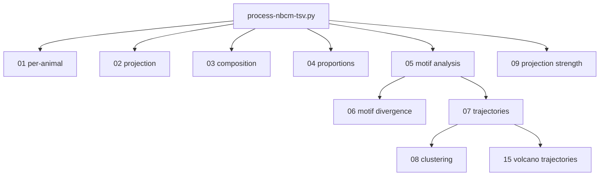

# Chapter 7: Helper Scripts

## Overview

After main processing (`process-nbcm-tsv.py`), **helper scripts** perform cross-age analyses and plots. Outputs live under:

`02_output/{parameterization}_helpers/{NN_script_name}/`

where `{parameterization}` matches your main output folder (e.g. `05.HAN_filter_parameters_i300_r10_t10_u5`). Paths in your tree may use a `_helpers` suffix on that folder name (e.g. `05.HAN_..._helpers`).

### Core vs optional (end users)

| Tier | Scripts | Notes |
|------|---------|--------|
| **Core** | 01–06, 07 (with prepared `07_input`), 08, 09, 15; often 13 | Typical developmental / trajectory workflow. |
| **Often in repo command file** | 17, 18, `10_plot_per_cell_projection_strength_across_ages.py` | Extra summaries or plots; depend on 01 and/or 05. |
| **Maintainer / lab-only** | 00, `10_compare_datasets_pipeline.py`, 11, 12, 16 | Barcode QC, external dataset compares, manuscript power analysis. See [Chapter 14](14_Experimental_Features.md). |

The **MAPseq_wizard** GUI lists only a subset of helpers; the authoritative list is this chapter and your edited `all_commands.txt`.

## Dependency graph (core)



**Critical**: Run **05** before **06** and **07**. Run **07** before **08** and **15**. Helper **15** reads upsetplot CSVs from `--input_dir` (often a copied `07_input` tree); see your command file for `find`/`cp` steps.

## Example batch order

The repository’s [`bash/all_commands.txt`](../../bash/all_commands.txt) is the reference ordering for this project. A typical block (after all `process-nbcm-tsv.py` runs) is:

1. **01**–**05** — cross-age tables and motif summaries  
2. **18** — mean JSD transition tests (reads helper **05** text outputs); optional  
3. **06** — divergence plots (needs **05**)  
4. **17** — cross-source JSD summary (needs **01** and **05**); optional  
5. Prepare **`07_input`**: copy aggregate `*_upsetplot_*.csv` files for models you want trajectories for  
6. **07** — trajectories (reads `07_input`)  
7. **15** — volcano trajectories (same `07_input` dir)  
8. **08**, **09** — clustering and projection-strength plots  
9. **`10_plot_per_cell_projection_strength_across_ages.py`** — per-cell lines across ages (optional visualization)  
10. **13** — aggregate `projection_summary.csv` across parameterizations (often once at end)  
11. **16** — power / manuscript analyses (maintainer; see Chapter 14)

Adjust paths to your `02_output` root.

---

## Script 01: Per-Animal Motif Analysis

**File**: `helpers/scripts/01_motif_analysis_per_animal.py`

**Purpose**: Motif frequency variation across ages with per-animal replication (Kruskal-Wallis, JSD, plots).

**Outputs**: `02_output/{parameterization}_helpers/01_motif_analysis_per_animal/{model}/`

---

## Script 02: Projection Analysis

**File**: `helpers/scripts/02_projection_analysis.py`

**Purpose**: PCA / clustering on projection patterns (not motif-significance testing).

**Outputs**: `02_output/{parameterization}_helpers/02_projection_analysis/`

---

## Script 03: Composition

**File**: `helpers/scripts/03_composition.py`

**Purpose**: UMI and projection count composition by age.

**Outputs**: `02_output/{parameterization}_helpers/03_composition/`

---

## Script 04: Proportions Over Time

**File**: `helpers/scripts/04_proportions_over_time_stats.py`

**Purpose**: Target-count-type proportions across ages; chi-square / CLR-related outputs.

**Outputs**: `02_output/{parameterization}_helpers/04_proportions_over_time_stats/`

---

## Script 05: Motif Analysis

**File**: `helpers/scripts/05_motif_analysis.py`

**Purpose**: Cross-age motif percentages, transition text summaries, matrices. **Required** before **06** and **07**.

**Outputs**: `02_output/{parameterization}_helpers/05_motif_analysis/`  
Key files: `motif_percent_matrix_by_age_{model}.csv`, `motif_transition_significance_summary_{model}.txt`

---

## Script 06: Motif Divergence

**File**: `helpers/scripts/06_all_motif_divergence.py`

**Purpose**: JS divergence bar plots per transition (needs **05**).

**Outputs**: `02_output/{parameterization}_helpers/06_all_motif_divergence/{model}/`

---

## Script 07: Motif Trajectories

**File**: `helpers/scripts/07_motif_significange_trajectories.py`

**Purpose**: Effect-size trajectories and **transition z-tests** (log-count delta method; optional FDR for the `Significant` flag). Kruskal-Wallis on n=1 per group was removed as invalid.

**Inputs**: `--input_dir` of upsetplot CSVs; `--helper_output_dir` for writes.

**Outputs**: `02_output/{parameterization}_helpers/07_motif_significange_trajectories/{model}/`  
Key files: `combined_effect_sizes_{model}.csv`, `transition_significance.csv`

**CLI** (common): `--use_fdr_for_significant`, `--exploratory_trend_pvalue`, `--unified_yaxis`

Details: [Chapter 5: Statistical Methods](05_Statistical_Methods.md)

---

## Script 08: Motif Clustering

**File**: `helpers/scripts/08_motif_clustering.py`

**Purpose**: Cluster motifs using helper **07** outputs. **Requires 07**.

**Outputs**: `02_output/{parameterization}_helpers/08_motif_clustering/{model}/`

---

## Script 09: Projection Strength Visualization

**File**: `helpers/scripts/09_plot_normalized_projection_strength_data.py`

**Purpose**: Normalized projection strength figures.

**Outputs**: `02_output/{parameterization}_helpers/09_plot_normalized_projection_strength_data/`

---

## Script 10 (command file): Per-cell projection strength across ages

**File**: `helpers/scripts/10_plot_per_cell_projection_strength_across_ages.py`

**Purpose**: One plot per motif with per-cell lines across p12/p20/p60 (reads `*ALL*_raw_data.csv` under each age).

**Status**: Optional visualization; appears in the repository `bash/all_commands.txt` as the script named `10_...` (not the dataset-compare script below).

---

## Script 13: Aggregate Projection Summaries

**File**: `helpers/scripts/13_aggregate_projection_summaries.py`

**Purpose**: Collect `projection_summary.csv` across ages/parameterizations.

**Outputs**: Under your chosen `--helper_output_dir` (see command file).

---

## Script 14: Model Group Comparison

**File**: `helpers/scripts/14_model_group_comparison.py`

**Purpose**: Compare uniform / region_specific / correlated (and related) outputs.

**Outputs**: `02_output/{parameterization}_helpers/14_model_group_comparison/`

---

## Script 15: Volcano Trajectories

**File**: `helpers/scripts/15_volcano_trajectories.py`

**Purpose**: Volcano-style trajectory plots and optional permutation, FDA, mixed-effects, distance, and legacy quadrant summaries.

**Requires**: Upsetplot inputs (`--input_dir`); for quadrant filtering, helper **07** `transition_significance.csv` when paths are configured.

**Outputs**: `02_output/{parameterization}_helpers/15_volcano_trajectories/{model}/` (subfolders `permutation/`, `fda/`, `method_comparison/`, etc.)

**CLI** (non-exhaustive): `--methods`, `--distance_metrics`, `--bootstrap_ci`, `--permutation_n`, `--input_dir`, `--helper_output_dir`, `--transition_significance_dir`

File-level reference: [Chapter 8](08_Output_Files_Interpretation.md), [Chapter 15](15_Trajectory_Results_Interpretation.md)

---

## Scripts 17 and 18 (optional summaries)

**17** — `helpers/scripts/17_jsd_cross_source_summary.py`: Homogeneity / cross-source JSD summaries; requires sibling **01** and **05** directories under the same `*_helpers` parent. Read the module docstring for scale warnings (helper 01 global JSD ≠ helper 05 per-motif JS²).

**18** — `helpers/scripts/18_mean_jsd_transition_tests.py`: Tests on mean motif-level JS² from helper **05** summaries; requires **05** outputs first.

---

## Optional dataset comparison scripts (not standard MAPseq)

These require **external** datasets and are usually absent from minimal command files:

- `helpers/scripts/10_compare_datasets_pipeline.py` (two-way)  
- `helpers/scripts/11_compare_vsv_mapseq_two_way.py`  
- `helpers/scripts/12_compare_datasets_pipeline_mapseq.py` (three-way)

See [Chapter 14: Experimental Features](14_Experimental_Features.md).

---

## Running helpers

```bash
# From repository root
python helpers/scripts/01_motif_analysis_per_animal.py --help
```

Batch mode: list commands in `all_commands.txt` and run `./run_commands.sh` from the repo root (see [Chapter 4](04_Main_Processing_Pipeline.md)).

## Output directory structure (reference)

```
02_output/{parameterization}_helpers/
├── 01_motif_analysis_per_animal/
├── 02_projection_analysis/
├── 03_composition/
├── 04_proportions_over_time_stats/
├── 05_motif_analysis/
├── 06_all_motif_divergence/
├── 07_input/                    # prepared upsetplot CSVs (not a .py script)
├── 07_motif_significange_trajectories/
├── 08_motif_clustering/
├── 09_plot_normalized_projection_strength_data/
├── 13_aggregate_projection_summaries/
├── 14_model_group_comparison/
├── 15_volcano_trajectories/
├── 17_jsd_cross_source/         # optional
└── 18_mean_jsd_transition_tests/  # optional
```

---

## Summary table

| Script | Purpose | Typical tier |
|--------|---------|----------------|
| 01 | Per-animal analysis | Core |
| 02 | Projection PCA/cluster | Core |
| 03 | Composition | Core |
| 04 | Proportions / CLR | Core |
| 05 | Motif cross-age | Core |
| 06 | Divergence plots | Core |
| 07 | Trajectories + transitions | Core |
| 08 | Clustering | Core |
| 09 | Projection strength plots | Core |
| 10 (plot) | Per-cell across ages | Optional |
| 10–12 (compare) | External dataset compares | Maintainer |
| 13 | Aggregate summaries | Core / batch |
| 14 | Model comparison | Optional |
| 15 | Volcano trajectories | Core |
| 16 | Power / manuscript | Maintainer |
| 17 | JSD cross-source | Optional |
| 18 | Mean JSD transition tests | Optional |

---

*Maintainer utilities (00 teleporting barcodes, 16 power, figure batch, conclusions): [Chapter 14: Experimental Features](14_Experimental_Features.md). Output file names: [Chapter 8](08_Output_Files_Interpretation.md).*
