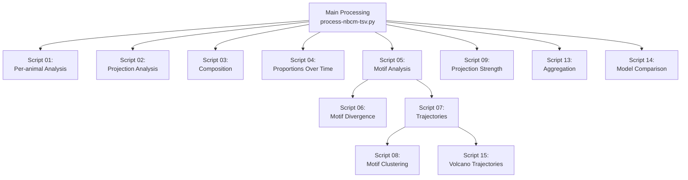

# Chapter 7: Helper Scripts

## Overview

After running the main processing pipeline (`process-nbcm-tsv.py`), helper scripts perform cross-age analyses, temporal comparisons, and visualization. These scripts are numbered by their execution order and have specific dependencies.

## Execution Order and Dependencies



**Critical Dependencies:**
- Script 05 must run before scripts 06 and 07
- Script 07 must run before script 08
- Script 15 (volcano trajectories) requires script 07; quadrant-filtered summaries use `transition_significance.csv` from helper 07 (path inferred from helper output dir)
- All scripts require main processing to complete first

## Script 01: Per-Animal Motif Analysis

**File**: `helpers/scripts/01_motif_analysis_per_animal.py`

**Purpose**: High-level statistical analysis of motif frequency changes across timepoints, accounting for individual animal variation.

### Statistical Tests

**Kruskal-Wallis Test**:
- Non-parametric test comparing motif frequencies across 4 timepoints (P3, P12, P20, P60)
- Null hypothesis: No difference in motif frequency distributions across ages
- Interpretation: p < 0.05 indicates significant change over time
- Advantages: Non-parametric, handles non-normal data, multiple groups

**Jensen-Shannon Divergence (JSD)**:
- Measures distribution similarity between ages
- Range: 0 (identical) to 1 (maximally different)
- Interpretation: JSD > 0.05 suggests meaningful difference
- Advantages: Symmetric, bounded, interpretable

**Global vs Domain-wise Normalization**:
- Global: Compares entire frequency distributions across all motifs
- Domain-wise: Compares within each motif complexity level (degree)

### Key Outputs

**Location**: `02_output/{parameterization}_helpers/01_motif_analysis_per_animal/{model}/`

- Bar plots with SEM across animals per timepoint
- Kruskal-Wallis results (CSV/text)
- JSD comparison matrices
- Cross-age comparison plots (global and domain-wise normalization)

### Questions Answered

- Do motif frequencies change significantly across ages? (Kruskal-Wallis)
- Which motifs show the most dramatic changes? (Effect sizes, JSD)
- Are changes consistent across animals? (SEM, individual animal data)
- Are changes uniform across all complexity levels? (Domain-wise analysis)

**Most Important for Stability Analysis**: ✅ **PRIMARY SCRIPT** - Directly tests temporal stability

## Script 02: Projection Analysis

**File**: `helpers/scripts/02_projection_analysis.py`

**Purpose**: PCA and clustering analysis of projection patterns (not directly temporal).

### Methods

- **Principal Component Analysis (PCA)**: Dimensionality reduction
- **Hierarchical Clustering**: Groups similar projection patterns
- **Heatmaps**: Visualize projection pattern similarities

### Key Outputs

**Location**: `02_output/{parameterization}_helpers/02_projection_analysis/`

- PCA plots comparing age groups
- Hierarchical clustering dendrograms
- Heatmaps of projection patterns

**Most Important for Stability Analysis**: ❌ **NOT TEMPORAL** - Cross-age comparisons only

## Script 03: Composition Analysis

**File**: `helpers/scripts/03_composition.py`

**Purpose**: Composition analysis by age (UMI and projection counts).

### Methods

- Descriptive statistics
- Composition plots by age

### Key Outputs

**Location**: `02_output/{parameterization}_helpers/03_composition/`

- UMI composition plots by age
- Projection count composition plots by age

**Most Important for Stability Analysis**: ⚠️ **DESCRIPTIVE** - Provides context but not statistical tests

## Script 04: Proportions Over Time

**File**: `helpers/scripts/04_proportions_over_time_stats.py`

**Purpose**: Analyze proportions of target types (1-7 targets) across ages.

### Statistical Tests

**Chi-square Test of Independence**:
- Tests if target type proportions are independent of age
- Null hypothesis: Proportions are independent of age
- Advantages: Good for categorical/count data

**CLR (Centered Log-Ratio) Transformation**:
- Compositional data transformation
- PCA on CLR Data: Dimensionality reduction of compositional changes

### Key Outputs

**Location**: `02_output/{parameterization}_helpers/04_proportions_over_time_stats/`

- `chi_square_summary.csv`: Chi-square test results
- `compositional_proportions.csv`: Proportions by age and target type
- `clr_transformed_data.csv`: CLR-transformed data
- Stacked bar plots and line plots of proportions
- CLR PCA plot
- Chi-square residuals heatmap

**Most Important for Stability Analysis**: ⚠️ **DESCRIPTIVE** - Analyzes target count distributions, not motif-specific

## Script 05: Motif Analysis

**File**: `helpers/scripts/05_motif_analysis.py`

**Purpose**: Cross-age motif percentage analysis with distribution comparisons.

**⚠️ REQUIRED** for scripts 06 and 07.

### Statistical Tests

**Welch's t-test**:
- Compares motif percentages between two ages (handles unequal variances)

**Kolmogorov-Smirnov Test**:
- Compares entire distributions between ages
- Null hypothesis: Distributions are identical
- Advantages: Non-parametric, sensitive to shape differences

**Jensen-Shannon Divergence**:
- Distribution similarity metric

**Hierarchical Clustering**:
- Groups motifs by temporal patterns

**PCA + KMeans**:
- Dimensionality reduction and clustering of temporal patterns

### Key Outputs

**Location**: `02_output/{parameterization}_helpers/05_motif_analysis/`

- `motif_percent_matrix_by_age_{model}.csv`
  - Rows: Motifs, Columns: Ages (P12, P20, P60)
  - Values: Percentage of observed motifs
- `motif_transition_significance_summary_{model}.txt`
  - Per-motif transition comparisons with JSD and significance flags
- `histogram_similarity_summary_{model}.txt`
  - Degree-wise comparisons with Welch's t-test, KS test, and JSD
- PDF plots: Motif percentage barplots by age (sorted and by rank)
- Clustering heatmaps and PCA plots

**Most Important for Stability Analysis**: ✅ **SECONDARY SCRIPT** - Provides detailed transition analysis

## Script 06: Motif Divergence

**File**: `helpers/scripts/06_all_motif_divergence.py`

**Purpose**: Visualize divergence patterns across age transitions.

**⚠️ REQUIRES** Script 05.

### Key Outputs

**Location**: `02_output/{parameterization}_helpers/06_all_motif_divergence/{model}/`

- `divergence_{transition}_{model}.svg`: Bar plots of JS divergence per transition
  - Shows significant (red) vs non-significant (blue) divergences
  - Transitions: P12vsP20, P20vsP60, P12vsP60

**Most Important for Stability Analysis**: ⚠️ **VISUALIZATION ONLY** - Complements script 05

## Script 07: Motif Trajectories

**File**: `helpers/scripts/07_motif_significange_trajectories.py`

**Purpose**: Motif-level analysis of effect size trajectories across developmental stages.

**⚠️ REQUIRES** Script 05.

### Statistical Tests

**Transition Z-Test** (Primary Method):
- Tests whether effect size changed significantly between consecutive stages
- Uses z-test on difference of log-transformed counts
- Standard error: SE(d) = 1/(ln(2) × √observed)
- Null hypothesis: No change in effect size between stages
- FDR correction applied within each motif across transitions
- See [Chapter 5: Statistical Methods](05_Statistical_Methods.md) for mathematical details

**Effect Size Tracking**:
- Tracks effect sizes across P3→P12→P20→P60

**Trend Analysis** (Exploratory Only):
- Linear regression of effect size on stage index
- **WARNING**: The trend p-value has very low statistical power with only n=4 points
- Use slope as descriptive statistic only; do NOT use p-value for formal hypothesis testing

### Methods Removed

**Kruskal-Wallis Test**: Removed in v2.0. The original implementation was statistically invalid because it applied Kruskal-Wallis with n=1 observation per group. Kruskal-Wallis requires multiple observations per group to estimate within-group variance.

### Key Outputs

**Location**: `02_output/{parameterization}_helpers/07_motif_significange_trajectories/{model}/`

- `combined_effect_sizes_{model}.csv`
  - Columns: `Motif_Label`, `Effect Size`, `Stage`, `Significant`, `Observed`
- `transition_significance.csv`
  - Columns: `Motif`, `Transition`, `P-value`, `Significant`, `Delta_Effect_Size`, `SE_delta`, `P_value_adjusted`
  - **Significant** is by default raw p ≤ 0.05; with `--use_fdr_for_significant` it is FDR-adjusted p ≤ 0.05 (within motif)
  - Script 15 uses this file for quadrant-filtered summaries
- `motif_trajectory_summary.csv`
  - Columns: `Motif`, `trend_slope`, `trend_direction`, `Delta_P3_to_P60`, `Delta_P3_to_P60_SE`, `Delta_P3_to_P60_CI_lower`, `Delta_P3_to_P60_CI_upper`, `Delta_P3_to_P60_p`, `N_stages_significant`
  - Optional: `trend_p_EXPLORATORY` (only with `--exploratory_trend_pvalue`)
- Trajectory plots (PDF): Effect size over time for each motif

### CLI / Options

- `--use_fdr_for_significant`: Set **Significant** in `transition_significance.csv` from FDR-adjusted p ≤ 0.05 instead of raw p
- `--exploratory_trend_pvalue`: Include the exploratory trend p-value in output (WARNING: low power with n=4)
- `--unified_yaxis`: Use unified y-axis range across all models

**Most Important for Stability Analysis**: ✅ **PRIMARY SCRIPT** - Identifies when changes occur

## Script 08: Motif Clustering

**File**: `helpers/scripts/08_motif_clustering.py`

**Purpose**: Clustering motifs based on effect size trajectories from script 07.

**⚠️ REQUIRES** Script 07.

### Methods

- Hierarchical clustering
- K-means clustering
- Evaluation metrics (silhouette, Calinski-Harabasz, Davies-Bouldin)

### Key Outputs

**Location**: `02_output/{parameterization}_helpers/08_motif_clustering/{model}/`

- Dendrograms
- Clustering heatmaps
- Motif ordering analysis
- Evaluation metrics

**Most Important for Stability Analysis**: ⚠️ **EXPLORATORY** - Groups motifs but doesn't test stability

## Script 09: Projection Strength Visualization

**File**: `helpers/scripts/09_plot_normalized_projection_strength_data.py`

**Purpose**: Visualize normalized projection strength data.

### Key Outputs

**Location**: `02_output/{parameterization}_helpers/09_plot_normalized_projection_strength_data/`

- Projection strength plots (individual and aggregate)

**Most Important for Stability Analysis**: ⚠️ **VISUALIZATION ONLY**

## Script 10: Dataset Comparison (Two-way)

**File**: `helpers/scripts/10_compare_datasets_pipeline.py`

**Purpose**: Two-way dataset comparison (requires external datasets).

**Status**: Optional, typically commented out in `all_commands.txt`

## Script 11: VSV vs MapSeq Comparison

**File**: `helpers/scripts/11_compare_vsv_mapseq_two_way.py`

**Purpose**: VSV vs MapSeq comparison (requires external datasets).

**Status**: Optional, typically commented out in `all_commands.txt`

## Script 12: Three-way Dataset Comparison

**File**: `helpers/scripts/12_compare_datasets_pipeline_mapseq.py`

**Purpose**: Three-way comparison (Allen, VSV, MapSeq) (requires external datasets).

**Status**: Optional, typically commented out in `all_commands.txt`

## Script 13: Aggregate Projection Summaries

**File**: `helpers/scripts/13_aggregate_projection_summaries.py`

**Purpose**: Aggregate projection summary data across all parameterizations.

### Methods

- Finds all `projection_summary.csv` files in output directories
- Filters for aggregate samples (containing "_ALL_" in sample name)
- Extracts metadata (age, parameterization) from file paths
- Combines all summaries into a single CSV file

### Key Outputs

**Location**: `02_output/{parameterization}_helpers/13_aggregate_projection_summaries/` or repository root

- Combined projection summary CSV with metadata columns

**Most Important for Stability Analysis**: ❌ **AGGREGATION ONLY** - Not for temporal analysis

## Script 14: Model Group Comparison

**File**: `helpers/scripts/14_model_group_comparison.py`

**Purpose**: Compare results across different probability models.

### Methods

- Compares uniform, region-specific, and correlated models
- Generates comparison plots and statistics

### Key Outputs

**Location**: `02_output/{parameterization}_helpers/14_model_group_comparison/`

- Model comparison plots
- Agreement statistics

## Script 15: Volcano Trajectories (v2.0)

**File**: `helpers/scripts/15_volcano_trajectories.py`

**Purpose**: Per-motif volcano trajectory plots (effect size vs −log₁₀(P)) across P3/P12/P20/P60 with unified axes, implementing multiple citable statistical methods for identifying trajectories that change significantly over time.

**⚠️ REQUIRES** Script 07 (for transition_significance.csv; path inferred from helper output dir).

### Statistical Methods (v2.0)

Script 15 now implements multiple publication-ready statistical methods:

| Method | Purpose | Citation |
|--------|---------|----------|
| Permutation tests | Non-parametric trajectory significance | Good (2005) |
| FDA trajectory tests | Tests for non-constant trajectories | Ramsay & Silverman (2005) |
| Mixed-effects models | Population-level stage effects | Bates et al. (2015) |
| Bootstrap CI | Quadrant classification uncertainty | Efron & Tibshirani (1993) |
| Z-score distance | Standardized path length | Standard |
| Mahalanobis distance | Covariance-aware path length | Mahalanobis (1936) |

See [Chapter 5: Statistical Methods](05_Statistical_Methods.md) for detailed descriptions and mathematical formulations.

### Legacy Methods (Retained for Compatibility)

- **Quadrant classification**: Bonferroni cutoff; trajectory "changes quadrant" if it has not_sig→sig or sig_pos↔sig_neg. Filtered by transition significance from helper 07.
- **Centroid 3+1 / 2+1 rule**: Ad-hoc method flagged as non-standard. Retained for backward compatibility but prefer permutation/FDA for publication.

### Output Directory Structure

```
15_volcano_trajectories/{model}/
├── per_motif_plots/           # Individual trajectory plots
│   └── {motif}_volcano_trajectory.{pdf,svg,png}
├── quadrant_change/           # Quadrant-based summary plots
│   ├── summary_all_trajectories.{pdf,svg,png}
│   ├── summary_all_trajectories_not_filtered.{pdf,svg,png}
│   ├── summary_all_trajectories_no_P3*.{pdf,svg,png}
│   └── summary_all_trajectories_centroid_dramatic*.{pdf,svg,png}
├── permutation/               # Permutation test results
│   └── permutation_test_results.csv
├── fda/                       # FDA test results
│   └── fda_trajectory_significance.csv
├── mixed_effects/             # Mixed-effects model results
│   ├── mixed_effects_summary.csv
│   └── mixed_effects_random_effects.csv
├── bootstrap_ci/              # Bootstrap CI (if enabled)
│   └── quadrant_bootstrap_ci.csv
├── distance_metrics/          # Standardized distance metrics
│   └── distance_comparison.csv
├── method_comparison/         # Cross-method comparison
│   ├── all_methods_summary.csv
│   ├── method_agreement_matrix.csv
│   └── significant_by_method.csv
└── change_criteria_comparison.csv  # Legacy comparison file
```

### Key Output Files

**permutation/permutation_test_results.csv**:
- `Motif`, `observed_stat`, `null_mean`, `null_sd`, `p_value`, `p_value_fdr`, `significant`

**fda/fda_trajectory_significance.csv**:
- `Motif`, `fda_statistic`, `null_mean`, `null_sd`, `p_value`, `p_value_fdr`, `significant`

**mixed_effects/mixed_effects_summary.csv**:
- `stage_coefficient`, `stage_pvalue`, `model_converged`

**distance_metrics/distance_comparison.csv**:
- `Motif`, `path_length_raw`, `path_length_zscore`, `path_length_mahalanobis`
- `effect_size_range`, `effect_size_sd`, `effect_size_total_variation`
- `significance_range`, `significance_sd`, `significance_total_variation`
- Percentile ranks (`*_pct`) for all metrics

**method_comparison/all_methods_summary.csv**:
- One row per motif with results from all methods
- `quadrant_change`, `quadrant_change_filtered`, `centroid_dramatic`
- `permutation_pvalue`, `permutation_pvalue_fdr`, `permutation_significant`
- `fda_pvalue`, `fda_pvalue_fdr`, `fda_significant`
- Distance metrics

**method_comparison/method_agreement_matrix.csv**:
- Pairwise agreement rates (%) between methods

### CLI Options

**Input/Output:**
- `--input_dir` (required): Directory of upsetplot CSVs
- `--helper_output_dir`: Output directory
- `--transition_significance_dir`: Helper 07 output for transition_significance.csv
- `--model_type`: Single model to process (default: all supported models)

**Plot Options:**
- `--no_volcano_ylim`: Use symmetric y-axis instead of [0, max]
- `--no_comparison_list`: Do not write change_criteria_comparison.csv

**Statistical Method Selection:**
- `--methods {all,quadrant,permutation,fda,mixed,none}`: Which methods to run (default: all)
- `--distance_metrics {all,none}`: Which distance metrics to compute (default: all)
- `--bootstrap_ci`: Enable bootstrap CI (slow, disabled by default)
- `--bootstrap_n INT`: Number of bootstrap samples (default: 1000)
- `--permutation_n INT`: Number of permutations (default: 10000)
- `--no_method_comparison`: Do not generate method comparison files

### Example Usage

```bash
# Run all methods (default)
python helpers/scripts/15_volcano_trajectories.py \
    --input_dir 02_output/p60_anchor/05.HAN.../07_input

# Run only permutation tests (faster)
python helpers/scripts/15_volcano_trajectories.py \
    --input_dir 02_output/p60_anchor/05.HAN.../07_input \
    --methods permutation

# Include bootstrap CI (slow but informative)
python helpers/scripts/15_volcano_trajectories.py \
    --input_dir 02_output/p60_anchor/05.HAN.../07_input \
    --bootstrap_ci --bootstrap_n 2000
```

**Most Important for Stability Analysis**: ✅ **PRIMARY SCRIPT** for trajectory significance testing. Use permutation or FDA results for publication; method_comparison files show robustness.

## Running Helper Scripts

### Individual Execution

Helper scripts can be run from the repository root or from the `helpers/` directory:

```bash
# From repository root
python helpers/scripts/01_motif_analysis_per_animal.py
python helpers/scripts/02_projection_analysis.py
# ... etc

# Or from helpers directory
cd helpers
python scripts/01_motif_analysis_per_animal.py
python scripts/02_projection_analysis.py
# ... etc
```

### Batch Execution

Use `all_commands.txt` or `all_commands_all-parameters.txt` in the repository root. From the repository root, make the script executable if needed (`chmod +x run_commands.sh`), then run:

```bash
./run_commands.sh
```

The script reads the command file line by line and executes each command in order; output is logged to a timestamped file. A copy of `run_commands.sh` may also exist in the `bash/` subdirectory (use `chmod +x bash/run_commands.sh` and `./bash/run_commands.sh` if using that copy). You can also run commands from `all_commands.txt` manually.

## Output Directory Structure

All script outputs are organized in `helpers/outputs/` with numbered subdirectories:

```
02_output/{parameterization}_helpers/
├── 01_motif_analysis_per_animal/
│   └── {model}/
├── 02_projection_analysis/
├── 03_composition/
├── 04_proportions_over_time_stats/
├── 05_motif_analysis/
├── 06_all_motif_divergence/
│   └── {model}/
├── 07_motif_significange_trajectories/
│   └── {model}/
├── 08_motif_clustering/
│   └── {model}/
├── 09_plot_normalized_projection_strength_data/
├── 13_aggregate_projection_summaries/
├── 14_model_group_comparison/
└── 15_volcano_trajectories/
    └── {model}/
        ├── summary_* (quadrant and centroid 3+1/2+1 highlight modes)
        ├── change_criteria_comparison.csv (quadrant vs centroid vs path_length/range)
        └── per-motif trajectory plots
```

## Key Files for Stability Analysis

### Primary Analysis Files

1. **Script 01: Kruskal-Wallis Results** ⭐ MOST IMPORTANT
   - Direct statistical test of temporal stability
   - P-values for each motif
   - Location: `01_motif_analysis_per_animal/{model}/`

2. **Script 07: Combined Effect Sizes CSV** ⭐ MOST IMPORTANT
   - Effect size trajectories for each motif
   - Location: `07_motif_significange_trajectories/{model}/combined_effect_sizes_{model}.csv`

3. **Script 07: Transition Significance CSV** ⭐ MOST IMPORTANT
   - P-values for each transition
   - Location: `07_motif_significange_trajectories/{model}/transition_significance.csv`

### Secondary Analysis Files

4. **Script 05: Motif Percentage Matrix** ⚠️ SECONDARY
   - Quantitative percentages for each motif at each age
   - Location: `05_motif_analysis/motif_percent_matrix_by_age_{model}.csv`

5. **Script 05: Transition Significance Summary** ⚠️ SECONDARY
   - Detailed transition analysis with JSD
   - Location: `05_motif_analysis/motif_transition_significance_summary_{model}.txt`

6. **Script 15: Volcano trajectories and change criteria** ⚠️ SECONDARY
   - Per-motif volcano trajectory plots (effect size vs significance across P3/P12/P20/P60).
   - Summary overlays: quadrant-change highlight (uses helper 07 `transition_significance.csv` when available) and centroid 3+1/2+1 rule (one point's quadrant ≠ centroid of the others; 4 points = 3+1, P12–P60 only = 2+1).
   - `change_criteria_comparison.csv`: quadrant_change, centroid_dramatic_full, centroid_dramatic_no_P3, path_length, effect_size_range, percentiles.
   - Location: `15_volcano_trajectories/{model}/`

## Summary

| Script | Purpose | Stability Analysis | Dependencies |
|--------|---------|-------------------|--------------|
| 01 | Per-animal analysis | ✅ PRIMARY | None |
| 02 | Projection analysis | ❌ Not temporal | None |
| 03 | Composition | ⚠️ Descriptive | None |
| 04 | Proportions over time | ⚠️ Descriptive | None |
| 05 | Motif analysis | ✅ SECONDARY | None |
| 06 | Motif divergence | ⚠️ Visualization | 05 |
| 07 | Trajectories | ✅ PRIMARY | 05 |
| 08 | Clustering | ⚠️ Exploratory | 07 |
| 09 | Projection strength | ⚠️ Visualization | None |
| 13 | Aggregation | ❌ Aggregation only | None |
| 14 | Model comparison | ⚠️ Model comparison | None |
| 15 | Volcano trajectories | ⚠️ Visualization (quadrant + centroid) | 07 |

---

*For interpreting helper script outputs, see [Chapter 8: Output Files and Interpretation](08_Output_Files_Interpretation.md). For stability analysis framework, see [Chapter 11: Stability Analysis](11_Stability_Analysis.md).*
