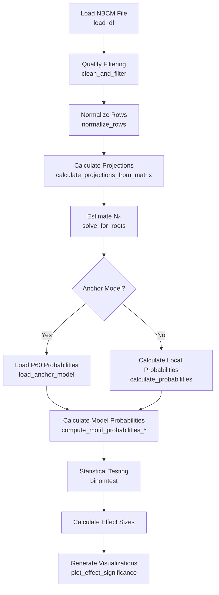

# Chapter 9: Code Review

## Overview

This chapter provides a comprehensive code review of the MAPseq processing pipeline, including architecture, key functions, data flow, and implementation details.

## Main Script Architecture

**Note:** Line numbers in this chapter are approximate and may change with code updates. Locate implementations by function name (e.g. `load_df`, `plot_effect_significance`) in `process-nbcm-tsv.py`.

### File Structure

**Main Script**: `process-nbcm-tsv.py` (~4300 lines)

**Organization** (approximate):
1. Imports and argument parsing
2. Utility functions (e.g. `calculate_projections_from_matrix`, `normalize_rows`)
3. Data loading and filtering (`load_df`, `clean_and_filter`)
4. Population estimation (`solve_for_roots`)
5. Probability model calculations (`compute_motif_probabilities_*`)
6. Statistical testing (e.g. `binomtest`)
7. Visualization (`plot_effect_significance`)

### Key Functions

#### Data Loading

**Function**: `load_df()` in `process-nbcm-tsv.py`

**Purpose**: Load and parse NBCM file

**Parameters**:
- `file`: Path to NBCM file
- `remove_cols`: Columns to remove
- `subset`: Subset of rows to load

**Returns**: DataFrame with barcodes and region columns

**Logic**:
1. Read TSV file
2. Extract barcode column
3. Remove specified columns
4. Apply subset if provided
5. Return cleaned DataFrame

#### Quality Filtering

**Function**: `clean_and_filter()` in `process-nbcm-tsv.py`

**Purpose**: Apply quality filters to matrix

**Parameters**:
- `matrix`: Input matrix
- `sample_labels`: Column labels
- `target_umi_min`: Target UMI threshold
- `injection_umi_min`: Injection UMI threshold
- `apply_outlier_filtering`: Enable outlier filtering
- `force_user_threshold`: Override automatic thresholding

**Returns**: Filtered matrix

**Filtering Steps**:
1. Remove zero-projection rows
2. Negative control filtering
3. Injection threshold
4. Target threshold
5. Injection-to-target ratio
6. Target UMI thresholding
7. Optional outlier filtering

**Code Reference**: `process-nbcm-tsv.py::clean_and_filter()`

#### Population Estimation

**Function**: `solve_for_roots()` in `process-nbcm-tsv.py`

**Purpose**: Estimate N₀ using inclusion-exclusion principle

**Parameters**:
- `projections`: Dictionary of region → projection count
- `observed_cells`: Number of observed cells

**Returns**: List of roots, symbolic π expression

**Logic**:
1. Define symbolic variables (N₀, k)
2. Build product expression: $\prod(1 - s_k/N_0)$
3. Calculate detection probability: $\pi = 1 - \prod(...)$
4. Solve equation: $\pi \times N_0 = N_{obs}$
5. Extract real roots
6. Return roots and π expression

**Code Reference**: `process-nbcm-tsv.py::solve_for_roots()`

**Root Selection** (in main script):
```python
valid_N0 = [root for root in roots if root.is_real and root > observed_cells]
N0_value = max(valid_N0)  # Largest valid root
```

#### Probability Model Calculations

**Uniform Model**: `compute_motif_probabilities()` in process-nbcm-tsv.py

**Region-Specific Model**: `compute_motif_probabilities_region_specific()` in process-nbcm-tsv.py

**Correlated Model**: `compute_motif_probabilities_correlated()` in process-nbcm-tsv.py

**See**: [Chapter 6: Probability Models](06_Probability_Models.md) for detailed implementations

#### Statistical Testing

**Function**: Uses `scipy.stats.binomtest()`

**Implementation**:
```python
p_value = binomtest(int(observed), n=int(N0_value), p=max(prob, 1e-10)).pvalue
```

**Code Reference**: `process-nbcm-tsv.py` (binomial testing)

## Data Flow

### Main Processing Flow



### Key Data Structures

**Matrix Format**:
- **Input**: DataFrame with barcodes and region columns
- **Filtered**: NumPy array (cells × regions)
- **Normalized**: NumPy array (each row normalized by max)

**Projection Dictionary**:
```python
projections = {
    'RSP': count_RSP,
    'PM': count_PM,
    ...
}
```

**Motif Probabilities Dictionary**:
```python
motif_probs = {
    0: prob_motif_0,
    1: prob_motif_1,
    ...
}
```

## Error Handling

### Common Error Patterns

**N₀ Estimation Failure**:
```python
if not valid_N0:
    raise ValueError(f"No valid positive real root found for N0")
```

**Column Mismatch**:
```python
assert normalized_matrix.shape[1] == len(columns), (
    f"Mismatch: Normalized matrix columns {normalized_matrix.shape[1]}, headers {len(columns)}"
)
```

**Empty Matrix**:
```python
if matrix.shape[0] == 0:
    print("⚠ WARNING: Normalized matrix is empty. Skipping normalization.")
    return matrix
```

## Performance Considerations

### Computational Complexity

- **N₀ Estimation**: O(regions²) for symbolic solving
- **Motif Probability Calculation**: O(2^regions) for all motifs
- **Statistical Testing**: O(motifs) for binomial tests
- **Visualization**: O(motifs) for plots

### Optimization Strategies

1. **Symbolic Solving**: Uses SymPy for exact solutions
2. **Vectorization**: NumPy operations for matrix calculations
3. **Caching**: Reuses calculated probabilities where possible

## Code Organization

### Modularity

**Functions are organized by purpose**:
- Data loading: `load_df()`
- Filtering: `clean_and_filter()`
- Normalization: `normalize_rows()`
- Estimation: `solve_for_roots()`
- Models: `compute_motif_probabilities_*()`
- Visualization: `plot_effect_significance()`

### Dependencies

**External Libraries**:
- `numpy`, `pandas`: Data manipulation
- `sympy`: Symbolic mathematics
- `scipy.stats`: Statistical tests
- `matplotlib`, `seaborn`: Visualization

**Internal Dependencies**:
- Helper scripts depend on main processing outputs
- Script 05 required for scripts 06 and 07
- Script 07 required for script 08

## Helper Script Architecture

### Common Patterns

**File Discovery**:
```python
# Find all upsetplot files
upsetplot_files = glob.glob(f"{base_dir}/*/analysis/{model}/*upsetplot*.csv")
```

**Data Aggregation**:
```python
# Combine data across ages
combined_data = pd.concat([df_p3, df_p12, df_p20, df_p60])
```

**Statistical Testing**:
```python
# Kruskal-Wallis test
from scipy.stats import kruskal
h_stat, p_value = kruskal(*age_groups)
```

## Best Practices

### Code Quality

1. **Function Documentation**: Key functions have docstrings
2. **Error Messages**: Descriptive error messages with context
3. **Type Hints**: Some functions use type hints
4. **Modularity**: Functions are reusable and well-separated

### Areas for Improvement

1. **Type Hints**: Could be more comprehensive
2. **Unit Tests**: Limited test coverage
3. **Documentation**: Some functions lack detailed docstrings
4. **Error Handling**: Could be more robust in some areas

## Code References

### Key File Locations

| Component | File | Notes |
|-----------|------|-------|
| Main script | `process-nbcm-tsv.py` | ~4300 lines; locate by function name |
| Preprocessing | `preprocess_and_aggregate.py` | ~222 lines |
| Helper 01 | `helpers/scripts/01_motif_analysis_per_animal.py` | - |
| Helper 05 | `helpers/scripts/05_motif_analysis.py` | - |
| Helper 07 | `helpers/scripts/07_motif_significange_trajectories.py` | - |

### Function Reference Table

| Function | File | Purpose |
|----------|------|---------|
| `load_df()` | `process-nbcm-tsv.py` | Load NBCM file |
| `clean_and_filter()` | `process-nbcm-tsv.py` | Quality filtering |
| `normalize_rows()` | `process-nbcm-tsv.py` | Row normalization |
| `solve_for_roots()` | `process-nbcm-tsv.py` | N₀ estimation |
| `load_anchor_model()` | `process-nbcm-tsv.py` | Load anchor probabilities |
| `compute_motif_probabilities_region_specific()` | `process-nbcm-tsv.py` | Region-specific model |
| `compute_motif_probabilities_correlated()` | `process-nbcm-tsv.py` | Correlated model |
| `gen_prob_matrix()` | `process-nbcm-tsv.py` | Conditional probability matrix |
| `plot_effect_significance()` | `process-nbcm-tsv.py` | Visualization |

---

*For mathematical implementations, see [Chapter 10: Mathematical Functions Reference](10_Mathematical_Functions.md). For usage instructions, see [Chapter 4: Main Processing Pipeline](04_Main_Processing_Pipeline.md).*
